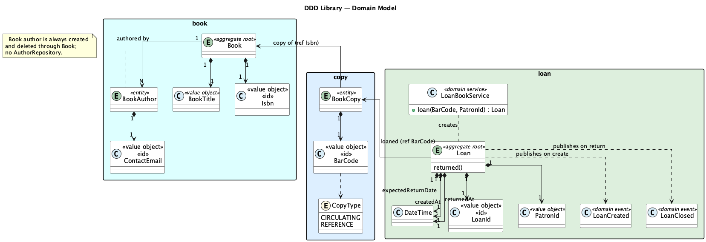

# Domain Model

## Functional Areas

The system is divided into three functional areas.  

| Functional Area | Responsibility |
| --------------- | -------------- |
| **Catalog**     | Manages the library's collection of book titles and physical copies |
| **Lending**     | Manages the borrowing lifecycle: loans and returns |
| **Security**    | Manages patron identity, authentication, and role-based access |

---

## Diagram

---

## Glossary

### Catalog Area

| Concept | Kind | Description |
| ------- | ---- | ----------- |
| **Book** | Aggregate Root | Represents a book _title_ in the library's catalog (not a physical object). Identified by its ISBN. Owns a list of `BookAuthor` entities. They cannot exist outside the `Book` aggregate. |
| **BookAuthor** | Entity | An author as they appear on a specific book. Identified by `ContactEmail`. Scoped to the `Book` aggregate. Always accessed through `Book`, never directly. The name `BookAuthor` (not `Author`) signals this scoping explicitly. |
| **BookCopy** | Aggregate Root | A single physical copy of a book that can be placed on a shelf or lent to a patron. Identified by `BarCode`. Tracks only existence in the catalog. Availability is the responsibility of the Lending area. |
| **Isbn** | Value Object | Validated ISBN-10 or ISBN-13 identifier for a book title. The domain identity of `Book`. |
| **BookTitle** | Value Object | A non-blank string representing the title of a book. Enforced at construction time so blank titles can never reach the domain. |
| **ContactEmail** | Value Object | A validated email address. Serves as the domain identity of `BookAuthor`. Used as the URL path parameter when editing an author's details. |
| **BarCode** | Value Object | String identifier for a physical copy. Lives in `common/` because both the Catalog area (as the identity of `BookCopy`) and the Lending area (stored on `Loan` as a reference) use it. Using the same type prevents accidental misuse; the areas are still decoupled because neither holds a direct object reference to the other's aggregates. |
| **CopyType** | Enum | Derived from the `BarCode` prefix. `CIRCULATING` copies (`BC-` prefix) can be lent out; `REFERENCE` copies (`REF-` prefix) cannot. The rule is encoded in `BarCode.copyType()`. |

### Lending Area

| Concept | Kind | Description |
| ------- | ---- | ----------- |
| **Loan** | Aggregate Root | Records a patron borrowing a physical copy. Created when a copy is lent; closed when returned. The only place where copy availability is tracked. The lending area owns this truth, not the catalog. |
| **LoanId** | Value Object | UUID-based domain identity for a `Loan`. Randomly generated at creation. |
| **PatronId** | Value Object | A UUID referencing a patron. Extracted from the JWT token at the web layer and passed into the domain without any coupling to the Security area. The domain never loads the `Patron` entity. |
| **LoanBookService** | Domain Service | Enforces the invariant that a copy must be available before a `Loan` is created. Queries `LoanRepository.isAvailable()` and delegates creation to `Loan`. Defined in the domain layer because the rule ("a copy cannot be lent if already on loan") is pure business logic. |
| **LoanCreated** | Domain Event | Published by `Loan` when a new loan is created. Carries the `BarCode` so downstream listeners can identify the copy without coupling to the aggregate. |
| **LoanClosed** | Domain Event | Published by `Loan` when a loan is returned. Carries the `BarCode`. |

### Cross-Cutting Patterns

| Pattern | Description |
| ------- | ----------- |
| **Aggregate Root** | The single entry point for mutating a cluster of domain objects. All invariants for the cluster are enforced through the root (`Book`, `BookCopy`, `Loan`). |
| **Value Object** | An immutable domain concept defined entirely by its value, not by identity. Created with validated constructors so invalid values can never be constructed (`Isbn`, `BarCode`, `ContactEmail`, `BookTitle`, `LoanId`, `PatronId`). |
| **Domain Event** | An immutable record of something that happened in the domain. Published by `Loan` (`LoanCreated`, `LoanClosed`) and consumed asynchronously by `LoanNotificationService` after the transaction commits. |
| **Repository** | An interface defined in the domain layer and implemented in the infrastructure layer. Makes persistence look like an in-memory collection to the domain. |
| **Domain Service Port** | A repository-like interface defined in the domain/application layer for a capability that requires external infrastructure (`BookSearchService`). Follows the Ports & Adapters pattern. |
| **Optimistic Locking** | `Loan` carries a `@Version` field. If two transactions try to modify the same loan concurrently, one will be rejected with a `DataIntegrityViolationException` rather than silently overwriting. |
| **Nullable Sentinel** | `Loan.activeBarCode` is `NULL` when the loan is closed, non-NULL when active. A unique database constraint on this column ensures at most one active loan exists per copy at any point in time, even under concurrent requests. |
