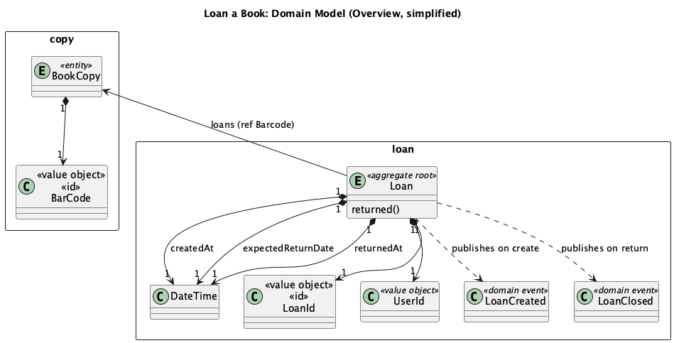
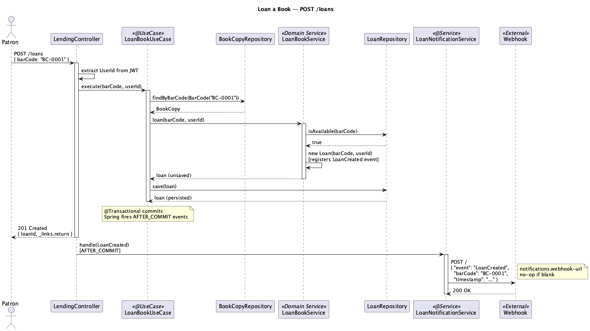
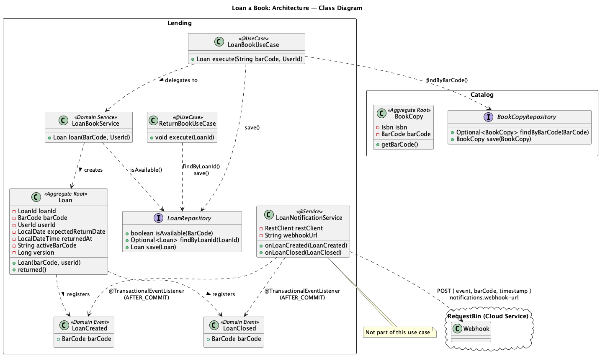

# Use Case: Loan a Book

A patron borrows a physical copy of a book from the library.

---

## Requirements

- A patron can borrow a copy by providing its barcode (the label on the physical book).
- A copy can only be on loan to one patron at a time.
- The system records who borrowed it, when, and the expected return date (30 days).
- Concurrent requests to borrow the same copy must not produce two active loans.

## Key Assumptions

- The patron's identity (`UserId`) is derived from the JWT token; the controller does not accept a user ID in the request body. User identities are taken care by the framework and we do not manage users.
- Copy availability is determined by querying the `Loan` aggregate directly (`LoanRepository.isAvailable`). `BookCopy` does not carry an `available` flag. The lending context is the single source of truth for availability.
- The 30-day return period is a hardcoded domain rule in the `Loan` constructor.
- A late return is detected in `Loan.returned()` but fee calculation is not yet implemented.

---

## Domain Model

This is an overview of the core entities and aggregates involved.



| Type | Name | Bounded Context | Role |
|---|---|---|---|
| Aggregate Root | `Loan` | Lending | Records the loan; availability is queried from this aggregate |
| Aggregate Root | `BookCopy` | Catalog | Represents a physical copy; identified and resolved by barcode; does not track availability |
| Value Object | `BarCode` | Shared (`library.common`) | Domain identity of a `BookCopy`; identifies the physical copy presented by the patron |
| Domain Service | `LoanBookService` | Lending | Enforces the availability invariant |
| Value Object | `UserId` | Lending | Identity of the borrowing patron |

---

### Sequence Diagram



---

## Architecture

Full class diagram showing how domain classes, application services, and infrastructure connect across layers.




**Lending** contains the core domain objects for the loan lifecycle:
- `Loan` is the aggregate root. Its constructor registers a `LoanCreated` event; `returned()` registers `LoanClosed`. It holds an `activeBarCode` column (set to `NULL` on return) that backs the unique constraint preventing double loans, and a `@Version` field for optimistic locking.
- `LoanBookService` is the domain service that enforces the *"one active loan per copy"* invariant by calling `LoanRepository.isAvailable()` before constructing a `Loan`.
- `LoanBookUseCase` is the application entry point. It resolves the physical copy via `BookCopyRepository.findByBarCode()` (a deliberate cross-context dependency — see note below), delegates availability checking and loan creation to `LoanBookService`, then persists the new `Loan` via `LoanRepository.save()`.
- `ReturnBookUseCase` looks up the loan by ID, calls `Loan.returned()`, and saves the loan.

**Catalog** is not directly coupled to Lending:
- `BookCopy` is the Catalog aggregate root. It is identified by its `BarCode` (the sticker on the physical item), which is the domain identity shared across both bounded contexts. `BookCopy` does **not** carry an availability flag. Whether a copy is on loan is determined by querying `LoanRepository.isAvailable(barCode)` in the lending context — the single source of truth.

**Cross-context dependency note.** `LoanBookUseCase` depends on `BookCopyRepository` from the catalog context to verify the copy exists before attempting a loan. This is an intentional design decision: catalog and lending are co-deployed modules within the same application and this coupling is confined to a single existence check at the application layer. It is documented with a comment in `LoanBookUseCase`.

---

## Code Patterns

### `@UseCase`: composed annotation

`LoanBookUseCase` is annotated with `@UseCase`, a custom composed annotation that combines `@Service` (Spring bean registration), `@Validated` (Bean Validation on method parameters), and `@Transactional` (wraps the method in a database transaction). Any `@UseCase` class is also intercepted by `UseCaseLoggingAdvice`, which logs method name, parameters, and execution time via AOP, with no log statements in the use case code itself.

```java
@UseCase
public class LoanBookUseCase {
    public Loan execute(String barCode, UserId userId) {
        BarCode bc = new BarCode(barCode);
        // Existence check against catalog's repository — intentional cross-context dependency.
        // Catalog and lending are co-deployed modules; this is the only cross-context call.
        bookCopyRepository.findByBarCode(bc).orElseThrow(() -> new BookCopyNotFoundException(bc));
        return loanRepository.save(loanBookService.loan(bc, userId));
    }
}
```

### Barcode as domain identity

`BarCode` is the domain identity of `BookCopy`. The controller receives the barcode string and passes it to the use case, which wraps it in a `BarCode` value object and uses it directly to resolve the copy and create the loan. No separate UUID identity is needed.

### Domain Service for invariant checks that require infrastructure

The rule *"a copy may only be loaned once at a time"* lives in `LoanBookService` rather than in the `Loan` constructor. Enforcing it requires a database query (`loanRepository.isAvailable`), and aggregates must stay free of infrastructure dependencies. The domain service sits in the domain layer but is allowed to depend on a repository interface.

```java
public Loan loan(BarCode barCode, UserId userId) {
    if (!loanRepository.isAvailable(barCode)) {
        throw new CopyNotAvailableException(barCode);
    }
    return new Loan(barCode, userId);
}
```

### Availability lives in the Loan aggregate

A copy is available if and only if it has no active `Loan` in the lending context. `BookCopy` does not carry an `available` flag — there is no dual state to keep in sync and no risk of the catalog and lending contexts diverging.

```java
// LoanRepository — the single source of truth for availability
@Query("select count(*) = 0 from Loan where barCode = :barCode and returnedAt is null")
boolean isAvailable(BarCode barCode);
```

### Domain events for extensibility

`Loan` extends `AbstractAggregateRoot<Loan>`. On construction it calls `registerEvent(new LoanCreated(barCode))`; on return it calls `registerEvent(new LoanClosed(barCode))`. Spring Data publishes registered events after `save()` commits (`AFTER_COMMIT` phase).

Events are **not** used to manage availability. `LoanNotificationService` demonstrates the pattern: it listens to both events and `POST`s a JSON payload to a configurable webhook URL.

```java
public Loan(BarCode barCode, UserId userId) {
    ...
    this.registerEvent(new LoanCreated(this.barCode));
}
```

`LoanNotificationService` requires no changes to any domain or use-case class:

```java
@TransactionalEventListener          // fires after the transaction commits
public void onLoanCreated(LoanCreated event) {
    post("LoanCreated", event.barCode().code());
}

// Payload sent to notifications.webhook-url:
// { "event": "LoanCreated", "barCode": "BC-0001", "timestamp": "2025-03-28T..." }
```

Configure the target with `notifications.webhook-url` in `application.properties`. Leave it blank to disable silently. A free ephemeral URL from [Pipedream RequestBin](https://pipedream.com/requestbin) works for demos with no account setup.

> **Note on response time.** `@TransactionalEventListener` runs synchronously in the same request thread after commit. If the webhook is slow it will delay the HTTP response to the patron. For production, add `@Async` to the listener methods.

### HATEOAS response

The controller returns a `201 Created` response with a hypermedia `return` link, so the client immediately knows how to return the book without having to construct the URL.

```java
Link returnLink = linkTo(LendingController.class).slash(loanId).slash("return").withRel("return");
EntityModel<LoanResponse> body = EntityModel.of(new LoanResponse(loanId), returnLink);
return ResponseEntity.status(HttpStatus.CREATED).body(body);
```

---

## Concurrency Safety

Two concurrent requests for the same copy can both pass the `isAvailable` check before either loan is persisted. Two mechanisms prevent a double loan:

1. **Database unique constraint** on `active_bar_code` (`uk_loan_copy_active`). This column holds the copy's barcode string while the loan is active and is set to `NULL` on return. The second concurrent insert fails with a constraint violation, which `GlobalExceptionHandler` translates into HTTP `409 Conflict`.

2. **Optimistic locking** (`@Version`) on `Loan` prevents two concurrent updates to the same loan (e.g. two threads trying to return the same copy simultaneously).
