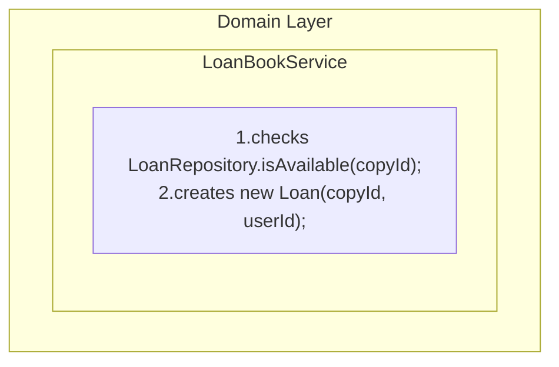
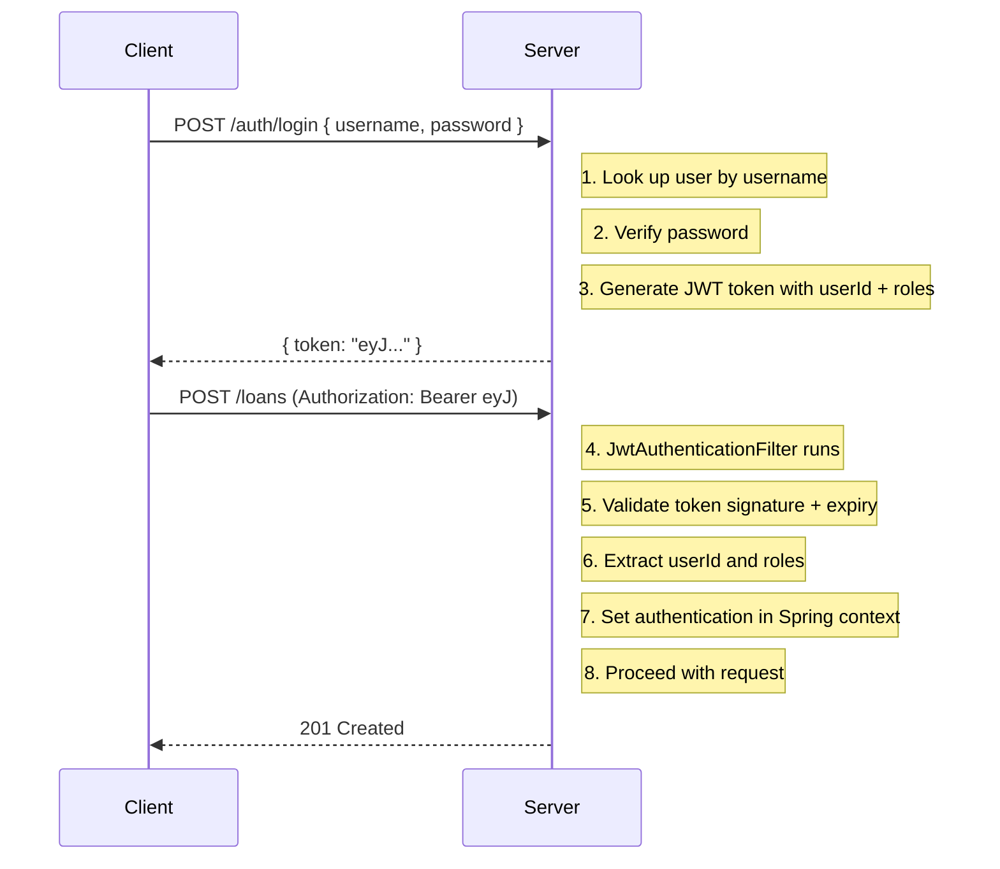
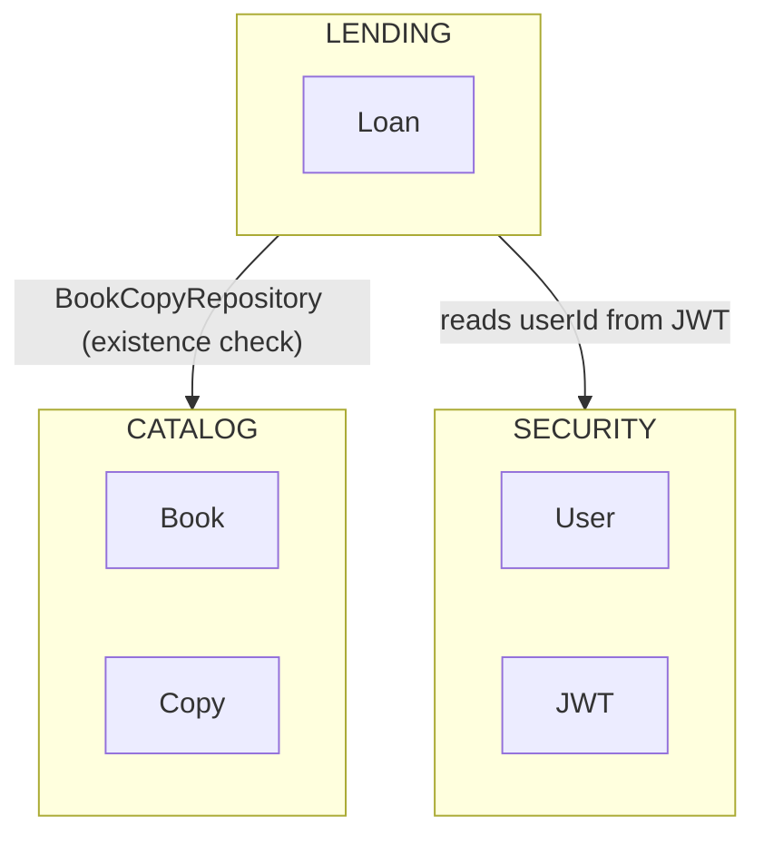

# DDD Library: Project Documentation

## Table of Contents

1. [What Is This Project?](#1-what-is-this-project)
2. [Technologies Used](#2-technologies-used)
3. [Domain Driven Design](#3-domain-driven-design)
4. [Project Structure Overview](#4-project-structure-overview)
5. [The Security Module](#5-the-security-module)
6. [The Catalog Module](#6-the-catalog-module)
7. [The Lending Module](#7-the-lending-module)
8. [Cross-Cutting Concerns](#8-cross-cutting-concerns)
9. [How the Modules Communicate](#9-how-the-modules-communicate)
10. [API Reference](#10-api-reference)
11. [Running the Project](#11-running-the-project)
12. [Testing Strategy](#12-testing-strategy)
13. [Glossary](#13-glossary)

------

## 1. What Is This Project?

This project is a **Library Management System**, started from the code used to support this [Spring IO 2024 talk](https://2024.springio.net/sessions/implementing-domain-driven-design-with-spring/): “Implementing Domain Driven Design with Spring”. It is built as a teaching example of **Domain Driven Design (DDD)** using the **Spring Boot** framework. 

It manages two core workflows:

- **Catalog management**: Adding books and physical copies to the library
- **Lending**: Loaning out and returning books

It makes this functionality available through a REST API and includes authentication and access control to enforce who can do what in the system.

------

## 2. Technologies Used

| Technology                | Purpose                                                      |
| ------------------------- | ------------------------------------------------------------ |
| **Java 21**               | The programming language                                     |
| **Spring Boot 3.3**       | The application framework                                    |
| **Spring Data JPA**       | Database access (talking to the DB without writing SQL)      |
| **Spring Security**       | Authentication and authorization                             |
| **H2 Database**           | A lightweight in-memory/file database for development        |
| **JWT (JSON Web Tokens)** | Stateless user authentication tokens                         |
| **Maven**                 | Build tool (compiles and packages the project)               |
| **Spring HATEOAS**        | Adds hypermedia links to REST responses                      |
| **JUnit 5 + Mockito**     | Testing framework                                            |
| **Open Library API**      | External API used to look up book information by ISBN        |

------

## 3. Domain Driven Design

Domain Driven Design (DDD) is a way of structuring software so that the code closely mirrors the **real-world problem domain** it models. In plain terms: the code should speak the language of the business.

### 3.1 The Ubiquitous Language

In DDD, developers and domain experts (e.g., librarians, business analysts) agree on a shared vocabulary. In this project:

- A **Book** is a title that exists in the catalog (e.g., *Clean Code*).
- A **Book Copy** is a physical instance of a book with a barcode (the actual object on the shelf).
- A **Loan** represents the act of a patron borrowing a specific copy.
- A **Patron** is a library member who can borrow books.
- A **Librarian** can add books and copies to the system.

The code uses these exact words as class names, `Book`, `BookCopy`, `Loan`, not generic terms like Item or Record.

### 3.2 Functional Areas

The system is divided into three **functional areas**:

- **Security**: who you are and what you can do
- **Catalog**: what books and copies exist
- **Lending**: which copies are borrowed and by whom

Each functional area lives in its own Java package and knows as little as possible about the others. This separation prevents one part of the system from becoming tightly coupled to another.

### 3.3 Aggregates and Aggregate Roots

An **Aggregate** is a cluster of related objects that are always kept consistent with one another. The **Aggregate Root** is the main object in that cluster, that controls access to all the others.

In this project:

- **Book** is an aggregate root. It manages book titles and their metadata in the catalog. It owns a `BookAuthor` entity list.
- **BookAuthor** is an entity *within* the `Book` aggregate. It is always accessed through `Book`; there is no standalone `BookAuthorRepository`. The name `BookAuthor` (rather than simply `Author`) makes the aggregate boundary visible in the type name. It signals that this entity has no independent life outside a `Book`.
- **BookCopy** is an aggregate root. It manages physical copies, referencing its book by `Isbn` only.
- **Loan** is an aggregate root. It controls its own lifecycle (creation, return).

### 3.4 Value Objects

A **Value Object** is an immutable object defined entirely by its value. Examples in this project:

| Class   | What it represents                                           |
| ------- | ------------------------------------------------------------ |
| Isbn    | An ISBN number (e.g., 9780132350884). Validates that it’s a real ISBN; serves as the domain identity of a Book |
| BarCode | A physical barcode string on a book copy. Must be non-blank and start with a recognised prefix (`BC-` for circulating copies, `REF-` for reference-only copies); exposes a `CopyType` enum that encodes the copy’s intended use. Serves as the domain identity of a `BookCopy` and is shared across the catalog and lending bounded contexts |
| ContactEmail | A validated email address that uniquely identifies an `Author` within the `Book` aggregate; returned in API responses so clients can reference a specific author when editing their bio |
| LoanId  | A UUID that uniquely identifies a loan                       |
| PatronId  | A UUID that uniquely identifies a patron within the lending context |

Value objects are **not entities** as they have no database identity of their own. They are embedded within entities. **Why immutability?** If an ISBN is 9780132350884, it should never change. Wrapping it in an immutable Isbn object ensures this is enforced by the code, not just by convention.

### 3.5 Domain Events

A **Domain Event** is something that happened in the domain that other parts of the system might care about. They are named in the past tense.

In this project:

- `LoanCreated`: fired when a patron borrows a book
- `LoanClosed`: fired when a patron returns a book

The **Lending** module fires these events after the transaction commits (`AFTER_COMMIT` phase). Other modules can listen to them without any coupling to the lending code. `LoanNotificationService` demonstrates the pattern: it `POST`s a JSON payload `{ event, barCode, timestamp }` to a configurable webhook URL (`notifications.webhook-url`) when a loan is created or closed. Adding a new listener (emails, push notifications, analytics) requires no changes to any domain or use-case code.

**Copy availability is not managed via events.** `BookCopy` does not carry an `available` flag. Availability is the lending context's sole responsibility and is always queried from `LoanRepository.isAvailable()`. There is no dual state to keep in sync, and no risk of the catalog and lending contexts diverging.

### 3.6 Domain Services

A **Domain Service** is a stateless service that holds domain logic that doesn’t naturally belong to a single entity or value object. It lives in the domain layer alongside the entities it works with.

In this project:

- LoanBookService enforces the invariant *”a copy may only be loaned once at a time”* and creates a new Loan if the copy is available.

The availability check requires a database query, so it cannot be performed within the Loan constructor. Instead, LoanBookService calls LoanRepository.isAvailable() and only constructs a Loan when the check passes. This keeps the Loan aggregate free of any infrastructure dependency while the business rule remains expressed in the domain layer.



### 3.7 Repositories

A **Repository** is an abstraction that makes domain objects feel like they live in an in-memory collection and hides implementation details such as the complexity of database operations. Repositories in DDD belong to the **domain layer** (as interfaces) but are implemented in the **infrastructure layer**.

### 3.8 Use Cases (Application Services)

A **Use Case** describes a specific piece of business functionality from the user’s perspective. Use cases follow a **command pattern**: each is a single class with a single `execute()` method. This makes the application’s capabilities explicit and easy to discover just by looking at the class names.

**Catalog**

| # | Use Case | Actor | Description |
| --- | --- | --- | --- |
| UC01 | `AddBookToCatalogUseCase` | Librarian | Given an ISBN, fetches the book title from OpenLibrary and saves a new `Book` to the catalog |
| UC02 | `EditAuthorDetailsUseCase` | Librarian | Updates the bio of an existing author, identified by their `ContactEmail` |
| UC03 | `RegisterBookCopyUseCase` | Librarian | Creates a physical `BookCopy` for an existing book title using its barcode; the book must already exist |
| UC04 | `ListBooksUseCase` | Anyone | Lists all books, or filters by title (partial, case-insensitive) or exact ISBN |

**Lending**

| # | Use Case/App. Service | Actor | Description |
| --- | --- | --- | --- |
| UC05 | `LoanBookUseCase` | Patron | Loan a book: resolves copy by barcode, checks availability via `LoanBookService`, creates and saves a `Loan` |
| UC06 | `ReturnBookUseCase` | Patron or Librarian | Return a book: finds the active `Loan` by ID, calls `loan.returned()`, and saves it. Any authenticated patron or librarian may return any loan by ID: see [7.4](#74-returning-a-book-walk-through) for the domain rationale |
| UC07 | `LoanNotificationService` | Patron, Librarian | Receive a notification when a book is loaned or returned |

### 3.9 The Layered Architecture

DDD is typically implemented with a layered architecture. Dependencies point **inward only**: presentation depends on application, application depends on domain, infrastructure implements domain interfaces. Importantly, the domain layer has **zero external dependencies**.

------

##  

## 4. Project Structure Overview

```
src/main/java/library/
│
├── LibraryApplication.java       ← Application entry point
├── Bootstrap.java                ← Seeds demo data on startup (dev profile only)
├── UseCase.java                  ← Custom annotation that marks use case classes
├── UseCaseLoggingAdvice.java     ← AOP aspect: logs all use case executions
│
├── common/                       ← Shared value objects used by multiple functional areas
│   └── BarCode.java              ← Value object: barcode string; domain identity of a BookCopy
│
├── security/                     ← Functional area: Authentication & Authorization
│   ├── AuthController.java       ← POST /auth/login endpoint
│   ├── SecurityConfig.java       ← Security rules for every endpoint
│   ├── application/
│   │   ├── JwtService.java       ← Token generation and validation
│   │   ├── LibraryUserDetailsService.java ← Loads user from DB for Spring Security
│   │   ├── LoginRequest.java     ← DTO: { username, password }
│   │   └── TokenResponse.java    ← DTO: { token }
│   ├── domain/
│   │   ├── Role.java             ← Enum: ADMIN, LIBRARIAN, PATRON
│   │   ├── User.java             ← User entity (stored in DB)
│   │   └── UserRepository.java   ← Finds users by username
│   └── infrastructure/
│       └── JwtAuthenticationFilter.java ← Reads JWT from each HTTP request
│
├── catalog/                      ← Functional area: Books and Copies
│   ├── CatalogController.java    ← GET/POST /catalog/books, POST /catalog/copies, PATCH /catalog/authors/{id}
│   ├── application/
│   │   ├── AddBookToCatalogUseCase.java  ← Looks up book by ISBN + saves it
│   │   ├── RegisterBookCopyUseCase.java  ← Creates a physical copy
│   │   ├── EditAuthorDetailsUseCase.java ← Updates bio and email of an existing author
│   │   ├── ListBooksUseCase.java         ← Lists/searches books
│   │   ├── BookSearchService.java        ← Interface for ISBN lookup
│   │   └── BookInformation.java          ← DTO: { title }
│   ├── domain/
│   │   ├── Book.java             ← Aggregate root: title + ISBN + authors
│   │   ├── BookAuthor.java       ← Entity within Book aggregate (@OneToMany); no own repository
│   │   ├── ContactEmail.java     ← Value object: validated email; domain identity of a BookAuthor
│   │   ├── Isbn.java             ← Value object: validated ISBN string; identifies a Book
│   │   ├── BookRepository.java   ← Find/save books (also finds by author contact email)
│   │   ├── BookCopy.java         ← Aggregate root: physical copy, identified by BarCode
│   │   └── BookCopyRepository.java ← Find/save copies
│   └── infrastructure/
│       ├── OpenLibraryBookSearchService.java  ← Calls openlibrary.org API
│       └── OpenLibraryIsbnSearchResult.java   ← JSON response DTO
│
└── lending/                      ← Functional area: Loans
    ├── LendingController.java    ← POST /loans, POST /loans/{id}/return
    ├── application/
    │   ├── LoanBookUseCase.java           ← Creates a loan
    │   ├── ReturnBookUseCase.java         ← Closes a loan
    │   └── LoanNotificationService.java          ← Demo: POSTs loan events to a webhook URL
    └── domain/
        ├── Loan.java                      ← Aggregate root: loan lifecycle; source of availability truth
        ├── LoanId.java                    ← Value object: UUID
        ├── LoanCreated.java               ← Domain event (fired on loan creation)
        ├── LoanClosed.java                ← Domain event (fired on loan return)
        ├── LoanRepository.java            ← Find/save loans; isAvailable(barCode)
        ├── LoanBookService.java           ← Domain service: enforces copy availability
        └── PatronId.java                  ← Value object: patron UUID
```

### Javadoc

Every public class, field, and method in the project is documented with Javadoc. To generate the HTML documentation locally:

```
./docs.sh        # macOS / Linux
docs.bat         # Windows
```

The generated docs will be at build/docs/javadoc/index.html.

### Domain Model Documentation

The domain model is documented in detail at [docs/domain-model.md](docs/domain-model.md)

### Use Case Documentation

Detailed write-ups for each use case live in `docs/`. Each document covers requirements, domain model, flow (text + sequence diagram), architecture class diagram, code patterns, and concurrency considerations (currently, only for UC05). 

| Document | Use Case |
| --- | --- |
| [docs/uc05-loan-book.md](docs/uc05-loan-book.md) | Loan a Book: patron borrows a copy by barcode |

------

### The Shared BarCode

`BarCode` lives in `common/` and is shared between the catalog and lending functional areas. The catalog uses it as the domain identity of a physical `BookCopy`; the lending area stores it on a `Loan` as a reference to the borrowed copy.

------

## 5. The Security Module

### 5.1 Roles and Permissions

The system defines three roles:

| Role      | Permissions                                                  |
| --------- | ------------------------------------------------------------ |
| ADMIN     | Can do everything                                            |
| LIBRARIAN | Can add books and copies to the catalog; can edit author details |
| PATRON    | Can loan and return books                                    |

### 5.2 The User Entity

Users are stored in the database table library_user. Each user has:

- A **UUID** (userId): the domain identity used in JWT tokens
- A **username**: unique login name
- A **password**: stored as a BCrypt hash (never plain text)
- A set of **roles**

### 5.3 How Authentication Works



### 5.4 JWT Tokens

A **JWT (JSON Web Token)** is a compact, self-contained token that contains:

- **Subject:** the user’s UUID
- **Claims:** the user’s roles
- **Expiry:** when the token stops being valid (1 hour)
- **Signature:** a cryptographic signature that ensures it hasn’t been tampered with

The server just validates the token’s signature and checks claims.

### 5.5 The Security Filter Chain

Spring Security processes every incoming HTTP request through a chain of filters. The custom JwtAuthenticationFilter runs before any controller is invoked:

1. Reads the Authorization: Bearer <token> header
2. Validates the token with JwtService
3. Extracts the user’s UUID and roles
4. Stores the authentication in the SecurityContextHolder
5. Passes the request forward to the controller

If the token is missing or invalid, the request proceeds unauthenticated. The authorization rules in SecurityConfig will then reject it for protected endpoints.

------

## 6. The Catalog Module

The catalog has **two aggregate roots**: `Book` (a title in the catalog) and `BookCopy` (a physical copy on the shelf). They are independent aggregates, `BookCopy` references `Book` by its `Isbn` value only, with no direct object link between them. This mirrors the same pattern used between `Loan` and `BookCopy` in the lending module.

### 6.1 The Book Aggregate

A Book represents a title in the catalog. It has:

- A title string
- An Isbn value object; the domain identity of the book
- A list of `BookAuthor` entities; owned by the aggregate via `@OneToMany`

**ISBN as domain identity.** In the real world, an ISBN is the globally recognised, unique identifier for a book title. The database still uses an internal pk column for physical storage, to avoid using a string (ISBN) as a primary key.

**BookAuthor as an entity within the aggregate.** `BookAuthor` has its own database row (with a generated `pk`) but belongs exclusively to the `Book` aggregate. It is always created, updated, and deleted through `Book`; JPA `cascade = ALL` and `orphanRemoval = true` enforce this. There is no standalone `BookAuthorRepository`. This is the canonical example of a JPA `@OneToMany` *within* an aggregate boundary.

The name `BookAuthor` (not just `Author`) is a deliberate naming choice to make the aggregate boundary visible in the type itself. A plain `Author` class suggests independence: it could have its own repository, be shared across books, or be modified without going through `Book`. The prefix `Book` signals that this entity only makes sense within the context of a book and has no standalone lifecycle.

Each `BookAuthor` is identified by their `ContactEmail` (embedded in the `contact_email` column, unique). Librarians use this email address to reference a specific author when editing their bio via `EditAuthorDetailsUseCase`.

### 6.2 The Isbn Value Object

The Isbn class is not just a String. It wraps the string and **validates** it on construction using the Apache Commons ISBNValidator. If you try to create an Isbn with an invalid value, you get an immediate IllegalArgumentException.

```java
new Isbn("9780132350884")  // valid: OK
new Isbn("1234567890123")  // invalid: throws exception immediately
```

This means invalid ISBNs **cannot exist** in the domain model. You never need to check “is this ISBN valid?” later in the code, if you have an Isbn object, it’s already valid.

### 6.3 The BookCopy Aggregate

`BookCopy` is its own aggregate root. It represents a single physical book on a shelf and has:

- A `BarCode` (the sticker on the physical book): domain identity, encodes the copy type via its prefix
- An `Isbn`: references the book title this copy belongs to (by value, not by object)

`BookCopy` does not hold a direct reference to a `Book` object. It stores only the `Isbn` value, keeping the two aggregates independently transactional.

`BookCopy` does **not** track availability. Whether a copy is currently on loan is the lending context’s responsibility and is determined by querying `LoanRepository.isAvailable(barCode)`. This keeps availability as a single source of truth: a copy is available if and only if it has no active `Loan`. Avoiding an `available` flag on `BookCopy` eliminates an entire category of consistency bugs where the catalog and lending contexts could diverge.

### 6.4 Adding a Book: Walk-Through

When a librarian calls POST /catalog/books with an ISBN:

```java
CatalogController.addBook(isbn)
    └─► AddBookToCatalogUseCase.execute(isbn)
            ├─► OpenLibraryBookSearchService.search(isbn)
            │       └─► GET "https://openlibrary.org/isbn/{isbn}.json"
            │               returns { title: "Clean Code" }
            ├─► new Book("Clean Code", isbn)
            └─► bookRepository.save(book)
```

1. The controller receives the ISBN from the HTTP request
2. The use case is called
3. The use case calls the BookSearchService to look up the book’s title on the Open Library API
4. A new Book entity is created with the title and ISBN
5. It is saved to the database

------

## 7. The Lending Module

### 7.1 The Loan Aggregate

Loan is the aggregate root of the lending functional area. It has:

- A LoanId (UUID)
- A `BarCode`: which copy was borrowed (shared domain identity from `library.common`)
- A `PatronId`: who borrowed it
- createdAt: when the loan was created
- expectedReturnDate: 30 days after creation
- returnedAt: when the copy was returned (null if still on loan)
- `activeBarCode`: holds the copy's barcode while the loan is active, `NULL` after return: a database-level sentinel that backs the uniqueness constraint preventing double-booking. Use `isActive()` in code rather than checking this field directly.
- `isActive()`: the explicit domain method that reflects whether the loan is still open (`returnedAt == null`). The `activeBarCode` column exists solely for the database constraint; `isActive()` is the domain-facing concept.
- A `@Version` field for optimistic locking on updates

### 7.2 Business Rules Enforced by the Domain Service

The rule *”a copy may only be loaned once at a time”* is enforced by LoanBookService, a domain service that lives in lending/domain/:

```java
// LoanBookService (lending/domain/)
public Loan loan(BarCode barCode, PatronId patronId) {
    if (barCode.copyType() == BarCode.CopyType.REFERENCE) {
        throw new ReferenceOnlyException(barCode);
    }
    if (!loanRepository.isAvailable(barCode)) {
        throw new CopyNotAvailableException(barCode);
    }
    return new Loan(barCode, patronId);
}


// Loan constructor (aggregate root)
public Loan(BarCode barCode, PatronId patronId) {
    Assert.notNull(barCode, “barCode must not be null”);
    Assert.notNull(patronId, “patronId must not be null”);
    // ... initialize fields
    registerEvent(new LoanCreated(this.barCode)); // published AFTER_COMMIT; LoanNotificationService POSTs to webhook
}
```

The availability check requires a database query, so it cannot live inside the Loan constructor without introducing an infrastructure dependency on the aggregate. LoanBookService handles the query and only creates a Loan when the check passes.

```java
LoanBookUseCase
    │
    └── LoanBookService.loan(barCode, patronId)
            ├── barCode.copyType() == REFERENCE       ← rejects reference copies
            ├── LoanRepository.isAvailable(barCode)   ← database query
            └── new Loan(barCode, patronId)           ← registers LoanCreated event
```

### 7.3 Concurrency Safety: Unique Constraint on Active Loans

The system prevents double-booking by enforcing a database-level uniqueness constraint. Loan carries a nullable column active_bar_code:

- Set to the copy’s barcode string when the loan is created (copy is out)
- Cleared to NULL when returned() is called

A UNIQUE constraint on active_bar_code means only one row with any given barcode can exist at a time. Because SQL UNIQUE constraints ignore NULL values, returned loans (where active_bar_code = NULL) never conflict with each other.

```
T1: INSERT loan(active_bar_code = "BC-0001") → OK
T2: INSERT loan(active_bar_code = "BC-0001") → constraint violation → 409 Conflict
```

The @Version field on Loan is still present for optimistic locking on **updates** (e.g., concurrent returns of the same loan), but it cannot prevent two concurrent *inserts*, that is the role of the unique constraint.

GlobalExceptionHandler catches DataIntegrityViolationException and translates it to an HTTP **409 Conflict** response.

> **Alternative (Option B):** Add @Version to Copy in the catalog context and flip an available flag atomically as part of rental. The OptimisticLockingFailureException thrown on the second concurrent write would serve the same purpose. This approach makes Copy the single source of truth for availability and avoids querying loan history, but it introduces a cross-area dependency from the lending service into the catalog repository.

### 7.4 Returning a Book: Walk-Through

When a patron calls POST /loans/{loanId}/return:

```java
LendingController.returnBook(loanId)
    └─► ReturnBookUseCase.execute(loanId)
            ├─► loanRepository.findByIdOrThrow(loanId)   ← throws LoanNotFoundException if not found
            ├─► loan.returned()
            │       ├─► sets returnedAt, clears activeBarCode
            │       └─► registerEvent(new LoanClosed(barCode))
            └─► loanRepository.save(loan)   ← persists changes and publishes domain events
```

**Return without ownership check.** The system does not verify that the person calling the return endpoint is the same patron who created the loan. This is a deliberate domain decision: in this library model, a librarian or any staff member may process a return at the desk regardless of who borrowed the book. The `loanId` UUID acts as a practical access token. Only someone who received the loan confirmation (or has administrative access) would know it. If the domain rules change to require patron-only returns, the check belongs in `Loan.returned(UserId)`, not in the controller.

------

## 8. Cross-Cutting Concerns

### 8.1 The @UseCase Annotation

```java
@Target(ElementType.TYPE)
@Retention(RetentionPolicy.RUNTIME)
@Service
@Validated
@Transactional
public @interface UseCase {}
```

This is a **custom annotation** that combines @Service (makes it a Spring-managed bean), @Validated (enables Bean Validation), and @Transactional (wraps every use case method in a single database transaction). Any class annotated with @UseCase is automatically:

- Registered as a Spring service
- Subject to method-level validation
- Wrapped in a database transaction, enabling `BEFORE_COMMIT` event listeners to run atomically with the use case
- Intercepted by the logging AOP advice (see next)

### 8.2 The Use Case Logging Advice

UseCaseLoggingAdvice uses Spring AOP (Aspect Oriented Programming) to intercept every method in every @UseCase class:

```java
@Around("@within(library.UseCase)")
public Object logUseCaseExecution(ProceedingJoinPoint joinPoint) throws Throwable {
    StopWatch watch = new StopWatch();
    watch.start();
    Object result = joinPoint.proceed();
    watch.stop();
    log.info("{} executed in {}ms with args {}",
        joinPoint.getSignature().getName(),
        watch.getTotalTimeMillis(),
        Arrays.toString(joinPoint.getArgs()));
    return result;
}
```

Without touching any use case class, every use case execution is logged with timing information. This is the power of AOP for cross-cutting concerns.

### 8.3 The Bootstrap Component

Bootstrap implements ApplicationRunner and is annotated with @Profile("dev"). It only runs when the dev Spring profile is active (using ./dev.sh).

It seeds the database with:

- 3 books (fetched from Open Library by ISBN)
- 2 copies per book
- 3 users (admin, librarian, patron)

This allows developers to immediately test the API without manually setting up data.

------

## 9. How the Modules Communicate

The three functional areas communicate in carefully controlled ways:



**General principle:** modules generally do not communicate. The Catalog module does not know about `Loan`. Copy availability is not managed via events; it is always queried directly from `LoanRepository.isAvailable(barCode)` in the lending context. Domain events (`LoanCreated`, `LoanClosed`) exist and are published, but no catalog code consumes them. They are available for extensibility (e.g. a Notifications module).

**One intentional exception.** `LoanBookUseCase` (lending application layer) depends on `BookCopyRepository` (catalog domain layer) to verify that a copy exists before attempting to create a loan. This is a deliberate architectural decision: catalog and lending are **co-deployed modules within the same application**, not separately deployed services. The coupling is acceptable, confined to a single existence check at the application layer, and documented with a comment in `LoanBookUseCase`. If these modules were ever extracted into separate services, this check would need to move to an anti-corruption layer or be expressed as a synchronous query to a catalog API.

This loose coupling still means:

- You could add new modules (e.g., Notifications) that listen to `LoanCreated` without changing any existing code
- The domain layers of catalog and lending remain decoupled; only the application layer of lending has visibility into catalog’s repository interface

------

## 10. API Reference

### Authentication

POST /auth/login

Authenticate and receive a JWT token.

**Request body:**

```json
{
  "username": "patron",
  "password": "patron123"
}
```

**Response (200 OK):**

```json
{
  "token": "eyJhbGciOiJIUzI1NiJ9..."
}
```

Use the token in subsequent requests as Authorization: Bearer <token>.

------

### Catalog

GET /catalog/books

List all books. Optionally filter by title or ISBN.

**Query parameters:**

- title: partial, case-insensitive title search
- isbn: exact ISBN search

**Response (200 OK):**

```json
{
  "_embedded": {
    "bookResponseList": [
      {
        "title": "Clean Code",
        "isbn": "9780132350884",
        "authors": [
          {
            "contactEmail": "uncle.bob@example.com",
            "name": "Robert C. Martin",
            "bio": null
          }
        ],
        "_links": {
          "self": { "href": "http://localhost:8080/catalog/books?isbn=9780132350884" }
        }
      }
    ]
  },
  "_links": {
    "self": { "href": "http://localhost:8080/catalog/books" }
  }
}
```

Each author includes a `contactEmail` (the domain identity). Use it with `PATCH /catalog/authors/{contactEmail}` to edit the author's bio.

Each book is wrapped in an EntityModel with a self link, and the collection is wrapped in a CollectionModel with its own self link (Spring HATEOAS HAL format).

*No authentication required.*

------

POST /catalog/books

Add a new book to the catalog (fetches title from Open Library).

**Request body:**

```json
{
  "isbn": "9780132350884",
  "authors": [
    { "name": "Robert C. Martin", "contactEmail": "uncle.bob@example.com" }
  ]
}
```

**Response:** 201 Created

*Requires LIBRARIAN or ADMIN role.*

------

PATCH /catalog/authors/{contactEmail}

Edit the bio of an existing author.

**Path parameter:** contactEmail: the contact email (domain identity) of the author (from `GET /catalog/books` response)

**Request body:**

```json
{
  "bio": "American software engineer and author, known for Agile Manifesto."
}
```

May be set to `null` to clear it.

**Response:** 204 No Content

*Requires LIBRARIAN or ADMIN role.*

------

POST /catalog/copies

Register a physical copy of a book.

**Request body:**

```json
{
  "isbn": "9780132350884",
  "barCode": "LIB-0001"
}
```

**Response:** 201 Created

*Requires LIBRARIAN or ADMIN role.*

------

### Lending

POST /loans

Borrow a copy of a book.

**Request body:**

```json
{
  "barCode": "LIB-0001"
}
```

**Response (201 Created):**

```json
{
  "loanId": "6ba7b810-9dad-11d1-80b4-00c04fd430c8",
  "_links": {
    "return": {
      "href": "http://localhost:8080/loans/6ba7b810-9dad-11d1-80b4-00c04fd430c8/return"
    }
  }
}
```

The response includes a return hypermedia link so the client knows immediately how to return the book.

*Requires PATRON or ADMIN role. The user is identified from the JWT token.*

------

POST /loans/{loanId}/return

Return a borrowed copy.

**Path parameter:** loanId: UUID of the loan

**Response:** 204 No Content

*Requires PATRON or ADMIN role. The system does not check that the caller is the original borrower. Any patron or admin may return any loan by ID. See [7.4](#74-returning-a-book-walk-through) for the domain rationale.*

------

## 11. Running the Project

### Prerequisites

- Java 21 (JDK)
- Internet access (for Open Library API calls during book addition)

### Scripts

| Script               | Command         | Description                                      |
| -------------------- | --------------- | ------------------------------------------------ |
| build.sh / build.bat | ./build.sh      | Compile and run tests                            |
| run-dev.sh / run-dev.bat   | ./run-dev.sh    | Run with demo data (dev profile, H2 database)    |
| run-prod.sh / run-prod.bat | ./run-prod.sh   | Run with production profile                      |
| docs.sh / docs.bat   | ./docs.sh       | Generate Javadoc (build/docs/javadoc/index.html) |
| diagrams.sh          | ./diagrams.sh   | Regenerate PlantUML diagram images in docs/images/ (requires `plantuml`) |

### Postman Collection

A ready-to-use Postman collection is included at `postman_collection.json`. Import it into Postman to explore and test all endpoints. It covers:

- Auth (login as admin / librarian / patron, token auto-saved as collection variables)
- Catalog (list/search books, add book, register copy, edit author bio)
- Lending (borrow and return a copy)

Run the folders in order: **Auth → Catalog → Lending**. The demo data seeded by `Bootstrap.java` (dev profile) matches the default collection variables (`testIsbn`, `testBarCode`).

### First Steps

1. Start with dev profile: `./run-dev.sh`
2. The H2 console is available at http://localhost:8080/h2-console
3. - JDBC URL: jdbc:h2:file:./data/library
   - Username: sa, Password: *(empty)*
4. Log in via API:

```bash
curl -X POST http://localhost:8080/auth/login \
  -H "Content-Type: application/json" \
  -d '{"username":"patron","password":"pat123"}'
```

1. Use the returned token for authenticated requests

### Demo Users (dev profile only)

| Username  | Password | Role      |
| --------- | -------- | --------- |
| admin     | admin123 | ADMIN     |
| librarian | lib123   | LIBRARIAN |
| patron    | pat123   | PATRON    |

------

## 12. Testing Strategy

The project has tests at four independent layers. Each layer is isolated from infrastructure concerns it does not own. No test in the domain or application layers starts a Spring context or connects to a database.

### Test Folder Structure

```
src/test/java/library/
│
├── catalog/
│   ├── domain/                    ← Domain unit tests (no Spring, no mocks)
│   │   └── BookTest.java
│   ├── application/               ← Use-case tests (Mockito only)
│   │   ├── AddBookToCatalogUseCaseTest.java
│   │   ├── RegisterBookCopyUseCaseTest.java
│   │   └── EditAuthorDetailsUseCaseTest.java
│   ├── infrastructure/            ← Adapter tests (@RestClientTest)
│   │   └── OpenLibraryBookSearchServiceTest.java
│   └── CatalogControllerTest.java ← Web slice (@WebMvcTest)
│
├── lending/
│   ├── domain/                    ← Domain unit tests
│   │   ├── LoanTest.java
│   │   └── LoanBookServiceTest.java
│   ├── application/               ← Use-case tests (Mockito only)
│   │   ├── LoanBookUseCaseTest.java
│   │   └── ReturnBookUseCaseTest.java
│   └── LendingControllerTest.java ← Web slice (@WebMvcTest)
│
├── common/
│   └── domain/                    ← Domain unit tests
│       ├── IsbnTest.java
│       ├── BarCodeTest.java
│       └── BookCopyTest.java
│
└── security/
    └── infrastructure/            ← Filter unit tests
        └── JwtAuthenticationFilterTest.java
```

### Layer 1: Domain Tests

Pure unit tests. No Spring, no Mockito, just instantiate domain objects and assert rules.

| Test Class          | What It Tests                                                              |
| ------------------- | -------------------------------------------------------------------------- |
| `IsbnTest`          | Valid ISBN-13 / ISBN-10 accepted; invalid format rejected                  |
| `BarCodeTest`       | Blank codes rejected; only `BC-` and `REF-` prefixes accepted; correct `CopyType` returned |
| `BookCopyTest`      | Null ISBN and null barcode rejected at construction                        |
| `BookTest`          | Book construction: blank title rejected, null ISBN rejected, empty authors list rejected; `getAuthors()` returns unmodifiable view |
| `LoanTest`          | Null barcode/userId rejection; `LoanCreated` event on creation; `LoanClosed` event on return; `LoanAlreadyReturnedException` on double-return |
| `LoanBookServiceTest` | Availability enforcement: `CopyNotAvailableException` when copy is on loan; loan created for available copy |

### Layer 2: Application Tests (Mockito)

Each use case is tested with its collaborators replaced by Mockito mocks. Spring is never loaded.

| Test Class                        | What It Tests                                                              |
| --------------------------------- | -------------------------------------------------------------------------- |
| `AddBookToCatalogUseCaseTest`     | Saves book with correct title; propagates `BookInformationNotFoundException`; rejects empty authors |
| `RegisterBookCopyUseCaseTest`     | Saves copy when book exists and barcode is new; throws `BookNotFoundException`; throws `DuplicateBarCodeException` |
| `EditAuthorDetailsUseCaseTest`    | Updates author bio; clears bio with `null`; throws `AuthorNotFoundException` for unknown email |
| `LoanBookUseCaseTest`             | Saves loan when copy is available; throws `BookCopyNotFoundException`; throws `CopyNotAvailableException` |
| `ReturnBookUseCaseTest`           | Marks loan returned and saves; throws `LoanNotFoundException`; throws `LoanAlreadyReturnedException` |

### Layer 3: Infrastructure Tests

Adapter-level tests that focus on the boundary with an external system or framework component.

| Test Class                          | Mechanism            | What It Tests                                                         |
| ----------------------------------- | -------------------- | --------------------------------------------------------------------- |
| `OpenLibraryBookSearchServiceTest`  | `@RestClientTest`    | Returns `BookInfo` for valid ISBN response; throws `BookInformationNotFoundException` when title is absent or blank |
| `JwtAuthenticationFilterTest`       | Plain unit test      | No auth header → no authentication; non-Bearer header ignored; invalid token ignored; valid token sets correct principal and roles; multiple roles propagated |

### Layer 4: Web Slice Tests (`@WebMvcTest`)

Controller tests load only the web layer: `DispatcherServlet`, security filter chain, and `GlobalExceptionHandler`. No service beans, no database. The real `SecurityConfig` is imported so role enforcement is tested end-to-end.

```java
@WebMvcTest(CatalogController.class)
@Import(SecurityConfig.class)   // ← real security rules; @MockBean JwtService prevents filter crash
class CatalogControllerTest { … }
```

| Test Class              | Endpoints Covered                                         | Key Scenarios                                              |
| ----------------------- | --------------------------------------------------------- | ---------------------------------------------------------- |
| `CatalogControllerTest` | `GET /catalog/books`, `POST /catalog/books`, `POST /catalog/copies`, `PATCH /catalog/authors/{email}` | 200 without auth (GET); 201/204 for LIBRARIAN; 403 for unauthenticated and PATRON role; 404/409 error mapping |
| `LendingControllerTest` | `POST /loans`, `POST /loans/{id}/return`                  | 201/204 for PATRON; 400 for missing barcode; 403 for unauthenticated; 404/409 error mapping |

### Testing Philosophy in DDD

In DDD the most important tests are **domain tests**. They verify that business rules are enforced by domain objects and domain services themselves. Use-case tests then confirm that the orchestration logic delegates correctly. Infrastructure and web tests guard the boundaries. This layering means the majority of the logic is verified without touching a database or starting a server.

